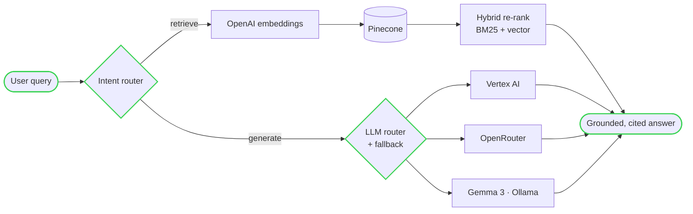

<!-- ═══════════════════════════════════════════════════════════════════
     Reuben Roy · GitHub profile README
     Terminal / neofetch aesthetic · AI-engineer framing · live dashboard
     Contribution snake is auto-generated by .github/workflows/snake.yml
════════════════════════════════════════════════════════════════════ -->

<div align="center">


<a href="https://reuben-roy.explosion.fun/cv"></a>

</div>

```
██████╗ ███████╗██╗   ██╗██████╗ ███████╗███╗   ██╗
██╔══██╗██╔════╝██║   ██║██╔══██╗██╔════╝████╗  ██║
██████╔╝█████╗  ██║   ██║██████╔╝█████╗  ██╔██╗ ██║
██╔══██╗██╔══╝  ██║   ██║██╔══██╗██╔══╝  ██║╚██╗██║
██║  ██║███████╗╚██████╔╝██████╔╝███████╗██║ ╚████║
╚═╝  ╚═╝╚══════╝ ╚═════╝ ╚═════╝ ╚══════╝╚═╝  ╚═══╝
██████╗  ██████╗ ██╗   ██╗   //  reuben-roy · reubenroyk@gmail.com
██╔══██╗██╔═══██╗╚██╗ ██╔╝   //  software engineer · AI · full-stack
██████╔╝██║   ██║ ╚████╔╝    //  Bay Area · Arizona · remote
██╔══██╗██║   ██║  ╚██╔╝
██║  ██║╚██████╔╝   ██║
╚═╝  ╚═╝ ╚═════╝    ╚═╝
```

```yaml
reuben@github ~ %  neofetch
─────────────────────────────────────────────────────────────
  role.......:  AI Engineer · Full-Stack Software Engineer
  education..:  MS Software Engineering · ASU '26 (NIT Calicut '21)
  uptime.....:  3+ years shipping production systems
  languages..:  Python · Java · C# · TypeScript · C++ · SQL
  frontend...:  React · Next.js · React Native · D3.js · Three.js
  backend....:  Spring Boot · .NET Core · FastAPI · GraphQL · REST
  ai / ml....:  LangChain · RAG · Vector DBs · LLM routing + fallback
  cloud......:  GCP · Azure · AWS · Oracle · Docker · CI/CD · Linux
  tooling....:  Claude Code · Gemini-CLI · Codex · self-hosted agents
  focus......:  agentic pipelines · data-viz · systems @ scale
─────────────────────────────────────────────────────────────
```

I build **backend systems that move real weight** (64TB+ HIPAA/FHIR migrations, microservices doing millions of transactions) and I'm now pointing that at **applied AI** — RAG pipelines, LLM routing, and agentic workflows. On the side I make the web *fun*: interactive 2D/3D data-viz, mobile apps, and tools I self-host end-to-end.

> This profile is partly self-maintaining — the snake below is regenerated by a GitHub Action, and I run an agent (`OpenClaw`) 24/7 that keeps my site, CV, and blog in sync.

<br/>

## `$ ./impact.sh` &nbsp;—&nbsp; numbers that shipped

<div align="center">


</div>

<br/>

## `$ cat rag_pipeline.mmd` &nbsp;—&nbsp; how I build with LLMs



<br/>

## `$ ls ~/toolbox`

<div align="center">


<br/>

<br/><br/>


</div>

<br/>

## `$ git log --stat` &nbsp;—&nbsp; live activity

<!-- github-metrics.svg + github-isocalendar.svg are generated by .github/workflows/metrics.yml
     and committed to this repo, so they render from raw.githubusercontent and never hit
     third-party rate limits (unlike the old shared readme-stats / trophy instances). -->
<div align="center">


<br/>


<br/>


<br/>


</div>

<!-- Snake animation — generated by .github/workflows/snake.yml, committed to the `output` branch -->
<div align="center">

<picture>
  <source media="(prefers-color-scheme: dark)" srcset="https://raw.githubusercontent.com/reuben-roy/reuben-roy/output/github-contribution-grid-snake-dark.svg" />
  <source media="(prefers-color-scheme: light)" srcset="https://raw.githubusercontent.com/reuben-roy/reuben-roy/output/github-contribution-grid-snake.svg" />
  
</picture>

</div>

<br/>

## `$ ls -la ~/projects`

```
drwxr-xr-x  reuben  staff   featured/     # a few things I'm proud of ↓
```

| Project | What it is | Stack |
|---|---|---|
| **[explosion.fun](https://github.com/reuben-roy/explosion.fun)** · [live ↗](https://explosion.fun) | Interactive media & content engine — 2D (D3) + 3D (Three.js) visualizations on a headless-WordPress backend, sub-100ms page transitions via SSG/ISR | `Next.js` `React` `GraphQL` |
| **[Side-Track](https://github.com/reuben-roy/Side-Track)** · [App Store ↗](https://apps.apple.com/app/side-track/id6755348971) | Weight-training tracker with a custom muscle-specific **fatigue/recovery engine**; syncs Apple Health + Google Fit | `React Native` `Expo` `SQLite` `Supabase` |
| **[Switch-Market](https://github.com/reuben-roy/Switch-Market)** | Supply-chain **demand-forecasting** + inter-store transfer tool that turns dead stock into sales | `JavaScript` `D3.js` |
| **[Window-Extension](https://github.com/reuben-roy/Window-Extension)** | Calendar-aware productivity Chrome extension | `TypeScript` |
| **[Ranker](https://github.com/reuben-roy/Ranker)** | Career-exploration app with skill matching & a dynamic role hierarchy | `TypeScript` |
| **[Clackinator](https://github.com/reuben-roy/Clackinator)** | macOS menu-bar app — mechanical-keyboard sounds as you type | `Swift` |

<br/>

## `$ cat contact.txt`

<div align="center">

<a href="https://linkedin.com/in/reuben-roy"></a>
<a href="mailto:reubenroyk@gmail.com"></a>
<a href="https://reuben-roy.explosion.fun/cv"></a>
<a href="https://explosion.fun"></a>
<a href="https://leetcode.com/reubenroyk"></a>

<br/><br/>

<samp>reuben@github ~ % echo "thanks for scrolling — let's build something."</samp>


</div>
